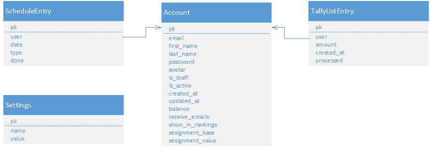

# Backend Architecture

The backend for our Coffee-in-the-Cloud application is written in Python using the django web service framework.

In the current application release the following modules are used.

## database layout

Each model is represented by a data table in our relational database. 



## authentication

The ```authentication``` module is responsible for user management and extends the built in system django uses. While
django provides a simple authentication and security system we decided to extend it in order to allow more
customization.

### API Endpoints

```GET /api/v1/accounts/``` Query a list of all registered accounts.

```GET /api/v1/accounts/{ID}/``` Query an account specified by {ID}.

```POST /api/v1/auth/login/``` Try to login a user with email and password.

```POST/api/v1/auth/logout/``` Logout the current user.

```GET /api/v1/auth/status/``` Query the login status of the current user.

```GET+POST /api/v1/auth/settings/``` Query or update the current user's settings.

### Models

**Account** This model extends the basic user model and extends to add neccessary fields like email address, name,
profile picture or user balance. Also different user settings are stored there. In order to replace the built in user
model with our own we added an ```AccountManager``` class which handles account
creation.

**Settings** This model allows application wide settings. Currently it is used to store the global available balance.

### Permissions

**IsAccountOwner** This permission checks if the currently logged in user is the owner of the given account. This is
needed in order to prevent users from editing another user's account.

**IsBalanceAdministrator** This permission checks if the currently logged in user is allowed to manage a user's
balance and view/change the global balance.

### Views

**AccountViewSet** This view allows querying all accounts with all details.

**LoginView** This view handles and validates user logins.

**LogoutView** This view handles user logouts.

**StatusView** This view allows querying the current login status. If the user is logged in he will receive all
account information as well as available permissions.

**SettingsView** This view allows the user to view and change their settings. This includes changing the profile
picture.

## schedule

The ```schedule``` module is responsible for the cleaning schedule. It provides models for schedule entries and does
the automatic cleaning assignment.

### API Endpoints

```GET /api/v1/schedule/``` Query the current cleaning schedule.

```GET /api/v1/schedule/{ID}/``` Query a specific schedule entry.

```POST /api/v1/schedule/done/``` Mark the current assignment as done.

### Models

**ScheduleEntry** This model represents one entry in the cleaning schedule and contains user, type and date
information. It overrides the saving behavior to automatically send an email.

### Views

**ScheduleEntryViewSet** This view allows querying all schedule entries.

**ScheduleDoneView** This view allows marking the currently assigned cleaning as done.

### Commands

**assignusers** This command assigns users for cleaing. It can be called by using ```manage.py assignusers
<numberOfWeeks>```. The algorithm used is described more in detail in the ```Module Description``` chapter.

## statistics

The ```statistics``` module is responsible for aggregating information about the coffee consumption. It defines no own
models or permissions.

### API Endpoints

```/api/v1/statistics/``` Query statistics for all tally list entries.

```/api/v1/statistics/own/``` Query statistics for the current user's tally list entries.

```/api/v1/statistics/type/``` Query statistics by coffee type (single/double).

### Views

**StatisticsView** This view groups all coffees by months and returns them to the application.

**StatisticsOwnView** This view groups the current user's coffees by months and returns them to the application.

**StatisticsCoffeeTypeView** This view groups all coffees by the amount (single or double) and returns them to the
application.

## tallylist

The ```tallylist``` module is responsible for tracking coffees. It provides the basic tracking functionality as well
as additional features.

### API Endpoints

```GET /api/v1/tally/``` Query the current user's tally list.

```GET /api/v1/tally-all/``` Query all tally list entries.

```GET /api/v1/tally/{ID}/``` Query a specific tally list entry.

```GET /api/v1/accounts/{ID}/tally/``` Query a specific user's tally list.

```GET+POST /api/v1/manage/balance/``` Query and modify the global balance.

```GET+POST /api/v1/blame/``` Blame the last user to have tracked a coffee.

### Models

**TallyListEntry** This model represents one entry on the tally list. It contains functionality to automatically
notify the user when the coffee was tracked. Apart from that the user's balance gets updated aswell.

### Permissions

**IsTallyUser** This permission checks if a tally list entry belongs to the current user.

**IsRecentTally** This permission check if a tally list entry is recent and thus can be removed.

### Views

**TallyListEntryViewSet** This view allows fetching all tally list entries for the current user.

**TallyListAllEntryViewSet** This view allows fetching all tally list entries.

**AccountTallyListEntryViewSet** This view allows fetching or adding tally list entries for/to a specific user.

**BlameView** This view allows blaming the last user that tracked a coffee.

**GlobalBalanceView** This view allows viewing and updating the global and user specific balance. Accessing this view
 requires the ```IsBalanceAdministrator``` permission.

## server

The ```server``` module acts as a configuration module for django.

**mail** This module contains functionality for sending notification emails.

**settings** This module contains basic django configuration, see the official documentation for details.

**urls** This module contains the endpoint configuration. New views have to be registered here in order to make them
accessable. Also the deployment of static files and the front end is configured here.

**wsgi** This module contains startup information for deploying the server using wsgi.