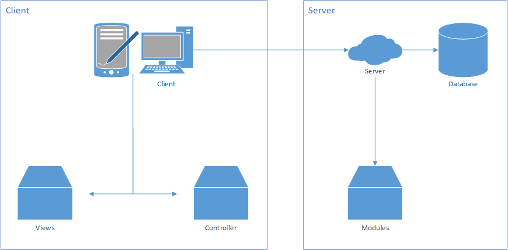

# Architectural Overview

The Coffee-in-the-Cloud application consists of a separated client and server part.
Both communicate through a common interface and will be described more in detail within
the next pages.

