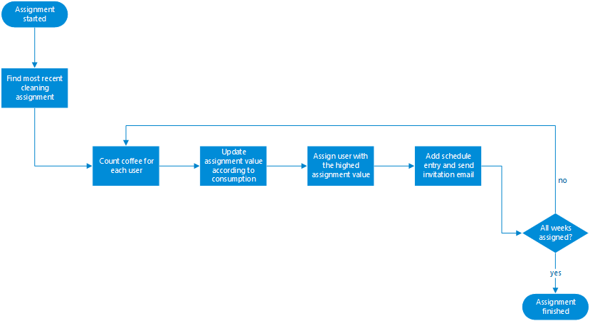

# Additional functionality

Not all of our features are publicly accessible and thus cannot be associated with one module. These will be described
in the following paragraphs.

## Cleaning assignment

Our application includes an algorithm to automatically assign users for cleaning. For example an assignment for 4 weeks
can be done through the server console by using the command ```manage.py assignusers 4```. Then the algorithm will
assign users depending on their coffee consumption within the last four weeks.

When searching for an algorithm that met our needs we came across several ideas. Our first approach was to either
randomly or evenly assign users for cleaning. This would create a distribution where everybody would clean the same
amount of times. Even though this would be fair in a scenario where all users drink the same amount coffee we had some
concerns because for example a person who drinks one coffee a month would have to clean as often as somebody who drinks
a coffee every day.

A solution to this is called **priority elevation** which is an algorithm mostly used in operating system scheduling.

The basic principle is that every user has a value associated that will be used for selecting. Each time the user is
not assigned for cleaning it will increase by a fixed amount. Because of this somebody who has not cleaned for a long
time has a higher chance of being assigned. After a user was assigned his assignment value is reset to a base value.
This decreases the chance of a user being assigned multiple times in a row.

In order to add more fairness regarding the coffee consumption we decided to increase each users' value based on the
coffee consumption since the last assignment was done. This allows us to assign users who drink a lot of coffee more
often while still having everybody assigned eventually.

The following flowchart illustrates the algorithm:



## Coffee pricing

In order to change the price of a single coffee a server administrator has to change the project configuration which is
found in the [```settings.py```](../../server/server/settings.py) and change the ```COFFEE_PRICE``` setting to the
desired value. The default value is ```0.25``` euros.

```python
COFFEE_PRICE = 0.25
```

The price of a double coffee is automatically calculated.
