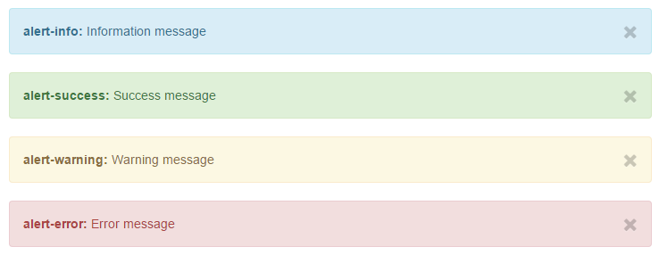

# Services

As some functionality was needed on multiple occasions we grouped them into services.

# coffeeCloud service

The ```coffeeCloud``` service is responsible for communicating with our backend. Each function sends a request with the
desired information to the server. All requests use the deferred API to allow chaining actions together and enable
parallel processing.

The requests are divided into three categories:

**user** mainly provides authentication functionality and allows querying user objects.

**tally** is responsible for adding or removing entries to a user's tally list.

**schedule** provides functions to query the cleaning schedule.

**statistics** fetches relevant data for generating statistics and preprocesses it.

**settings** allows fetching and storing a user's settings.

**balance** allows a user to manage the global balance.

**blame** encapsulates the blame feature.

# status service

The ```status``` service is responsible for displaying notifications to the user. These are based on bootstrap alerts
and are dynamically generated. The service supports information, success, warning and error messages.


