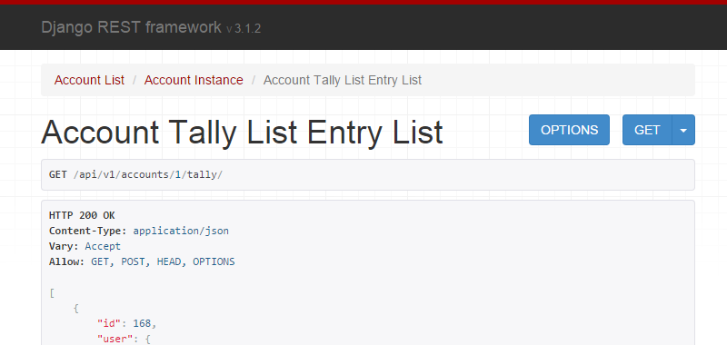
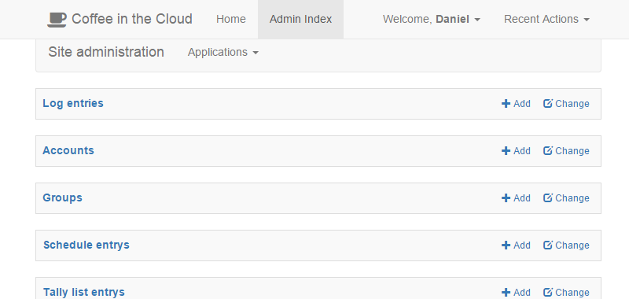

# Finding a backend framework

As our application needed a web service to run permanently we first had to decide on a framework. We narrowed down
our options to three different technologies some of us had already worked with.

## Flask

Flask is a lightweight framework for creating web services written in Python. It offers basic routing and has has
close to no overhead. While it is very easy to use it only provides very basic functionality and thus we would have
to implement many core features like session management or database-models ourselves. Also flask has no strict project
structure which could lead to an unstructured code base if not maintained properly. Because we didn't want to take this
risk we decided against the flask framework.

## node.js

Node.js is a powerful framework for creating web services written in Javascript. As we were using node.js' package
manager for managing our front end dependencies it seemed natural to use node.js for our backend as well. The downside
to node.js was that none of us had already built a more complex platform using it, so we would have to slowly learn all
necessary features. We also had no knowledge of available APIs and functionality which means we would have to
familiarize ourselves with these before actually starting to develop our app.

## Django

Django is a web framework also written in Python. It has a more complex structure but includes a lot of additional
functionality we would not have to implement ourselves. The core features we rely on are session management,
object-relationship-management for creating our database and url-routing for the API endpoints.

We had some experience in working with django from previous projects and it integrated perfectly with our requirements.

In addition to django we are using the ```rest_framework``` library to ease the creation of a restful API. This
framework provides features to automatically create endpoints from models, data serialisation and validation.

# Django - a short introduction

A django project consists of several modules, which are thematically separated. Each module contains models, views
and other classes needed.

Django follows the MVC architecture, separating data, logic and display. Because of this it is possible to develop
logic and interface separately from each other and maintain a clean project structure.

## Models

A model is a class that describes the data structure of objects. Instances of these models are automatically stored
into and loaded from our database. Also changes are automatically tracked and can be reverted at any time.

Models are defined in each module within a ```models.py``` file. This file then contains one class for each model.
These in general are a subclass of the type ```django.db.models.Model``` and define all fields as python data types.
In addition to simple data types like numbers and text django also provides complex data types like dates or files which
are automatically validated. It supports all features that are important for a relational database.

Apart from fields a model can also specify special behavior, for example for automatic validation when editing field
values or relationships between models.

## Permissions

A permission allows access restriction based on users and groups. The built in permissions can be extended to allow
custom control. These can then be assigned to specific users or user groups.

Permissions can be set automatically by the system or through the administration interface.

## Views

A view is responsible for converting model data into viewable information. In our case each view either loads models
from the database and converts then into a json response or processes a request and changes a model's state. We
separated our angularjs front end from the backend so our views will only represent the needed API endpoints and will
not create viewable HTML.

As we are using the ```rest_framework``` extension we do not have to handle json conversion and object validation
ourselves. Each view can so define different methods for viewing or manipulating data.

For example a ```list``` method allows automatic rendering of an object list. ```post``` and ```get``` respectively
handle POST and GET requests via HTTP.

The ```rest_framework``` also provides some debugging utility. For example when accessing an endpoint directly it
displays additional information like available methods and allows drafting new requests. Apart from testing purposes
this can also be used as a developer documentation.



In order to grant an application access to a newly created view it has to be registered in the routing system. This
can be found in the [```urls.py``` file](../../server/server/urls.py) and lists all API endpoints available.

## Serializers

A serializer is responsible for converting a model into a json representation. In most cases it defines a collection
of fields that are publicly accessible. For special cases like account creation it is possible to add custom
validation behavior, which in this example validates the password and then updates session information.

## Migrations

Migrations are a powerful tool to alter models without manually changing the database structure. They can be created
automatically by django after a model has been changed. It also allows for multiple developers to change the models
and then merge all changes. For example when a new field is added to a model the author can define a default value to
be set when an existing database is upgraded. In some cases this is necessary to not break any existing validation
constraints.

A new migration can be created through the server console via the ```manage.py makemigrations``` command. Afterwards all
pending migrations can be applied by using ```manage.py migrate```. This step is not necessary when creating a new
database as django automatically applies the needed changes.

## Management/Commands

Each module can define special commands to be used from the management console (```manage.py```). These in general
are used for administration purposes and can only be accessed from the server side. In our application this is used
for handling automatic schedule assignment.

Commands can be used to run a special task periodically by connecting them with a scheduling tool like crontab.

## Templates

A template contains formatted text that can be dynamically filled with information. Usually these are used for
creating dynamic HTML responses, in our application we only use then for the email functionality.

## Static file deployment

In our application we use django to deploy all static files including our angularjs app. Because of this there is no
need for a secondary web server like apache. Any request that does not match a defined endpoint will be resolved within
a given directory which is specified inside the server configuration.

## Settings

To configure the server django provides a configuration file which can be found at
[```/server/server/settings.py``` file](../../server/server/settings.py). The most important settings are

**INSTALLED_APPS:** A list of installed modules and frameworks in this application. When a new module is created it has
to be added to this list manually.

**DATABASES:** A list of available databases that can be accessed by the application. By default an sqlite3 connection
is configured here.

**LANGUAGE_CODE, TIME_ZONE:** This setting provides localisation. By default it is set to an English locale and the
Central European Time zone.

**STATICFILES_DIRS:** A list of paths where django will search for static files. For our application it is important
to include the client directory because otherwise it cannot be deployed.

**MEDIA_ROOT:** A directory where django will store uploaded files which should be given as an absolute path. This
directory has to be writable because otherwise any uploads will fail.

## Custom settings

Apart from default settings we use the configuration file to add our own options.

**AUTH_USER_MODEL:** Name of the desired user model. In our application we use an own model which includes additional
fields.

**COFFEE_PRICE:** The price of a single coffee in euros.

**MAIL_SERVER, MAIL_SENDER:** Email configuration for notifications, set to the HPI server by default.

## Administration interface

Django provides an administration interface which allows all users tagged as ```staff``` to manipulate models directly.
This can be used to correct errors or create objects manually. Every action taken in the administration interface will
be logged in case some unwanted changes are made.

A common usage would be to change a user's password, in case they forgot it.

