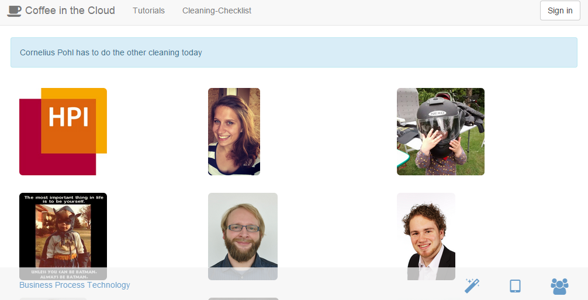
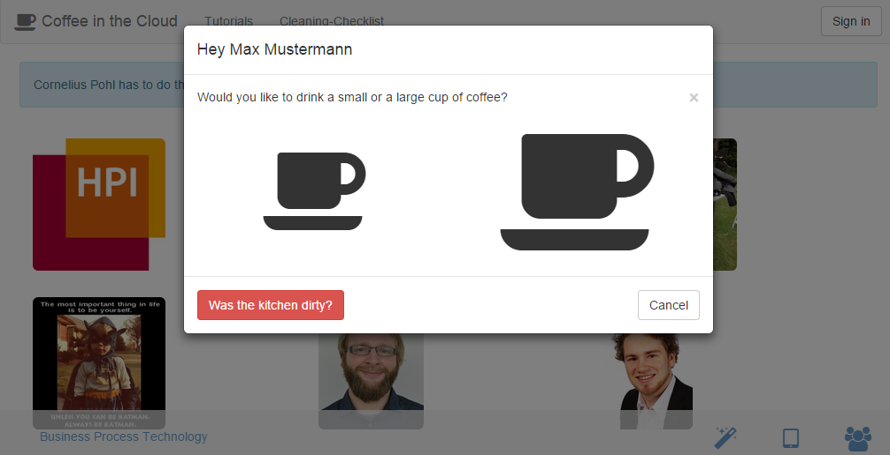
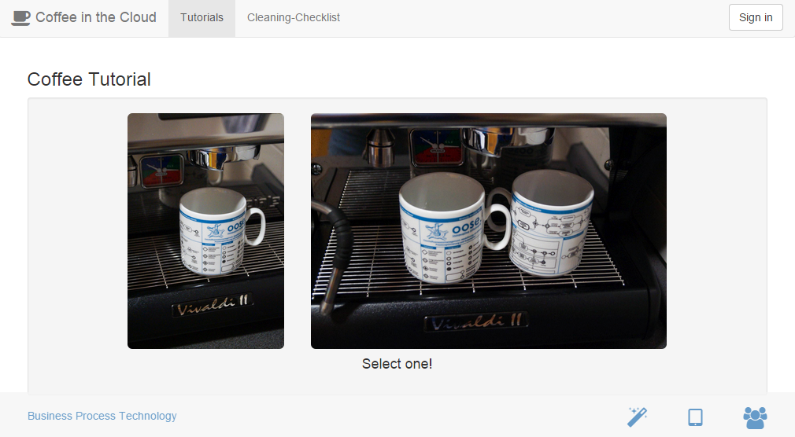
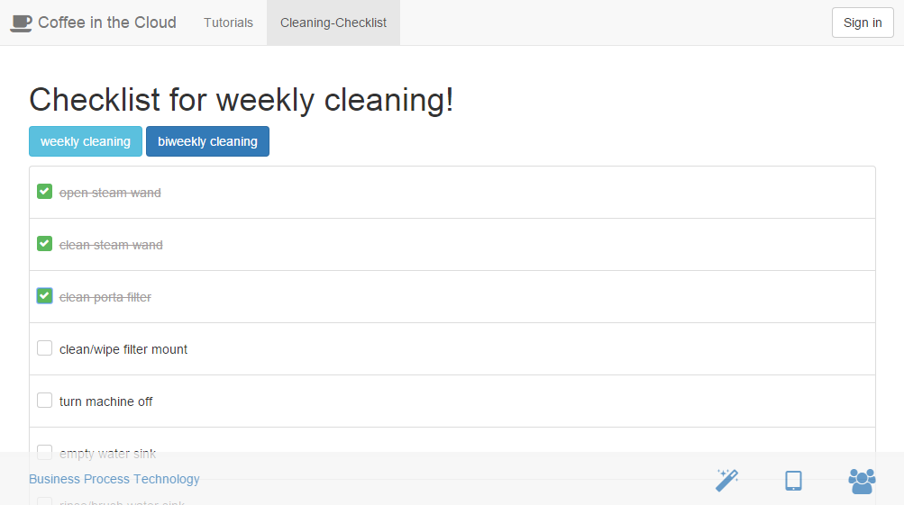
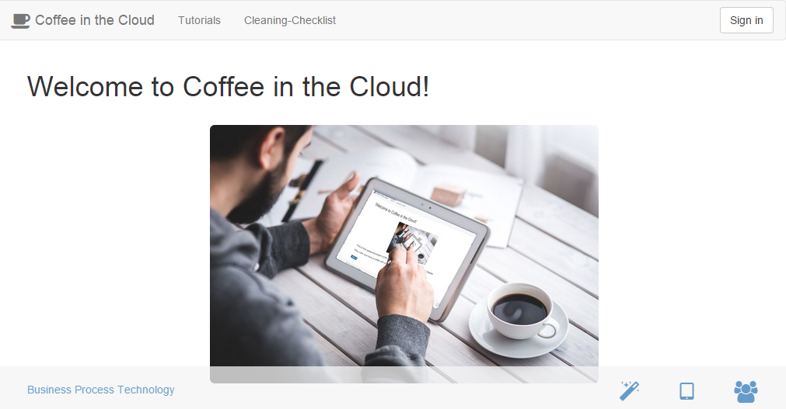
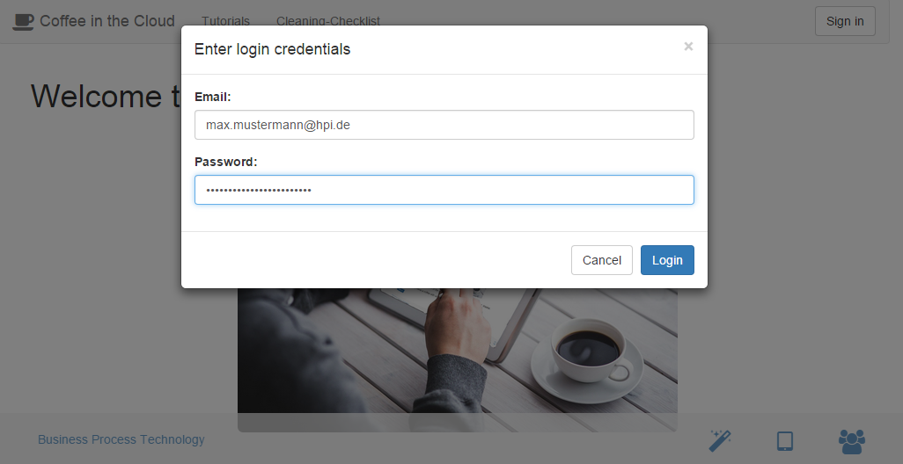
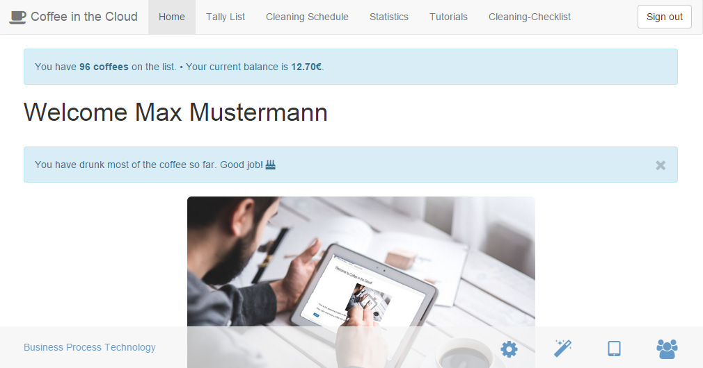
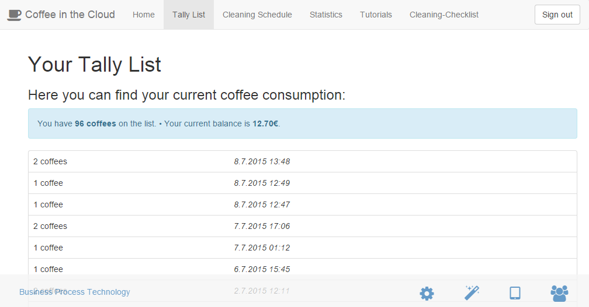
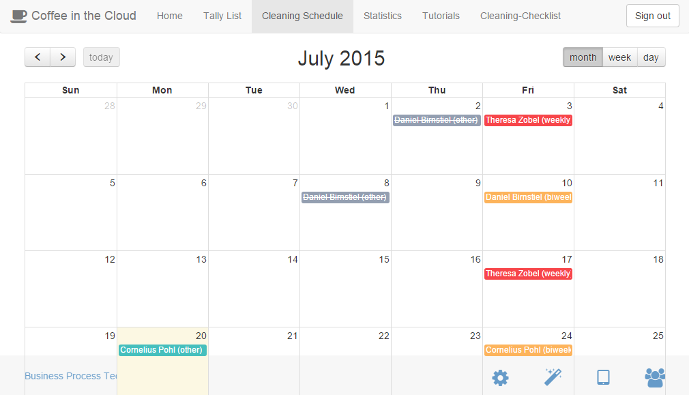
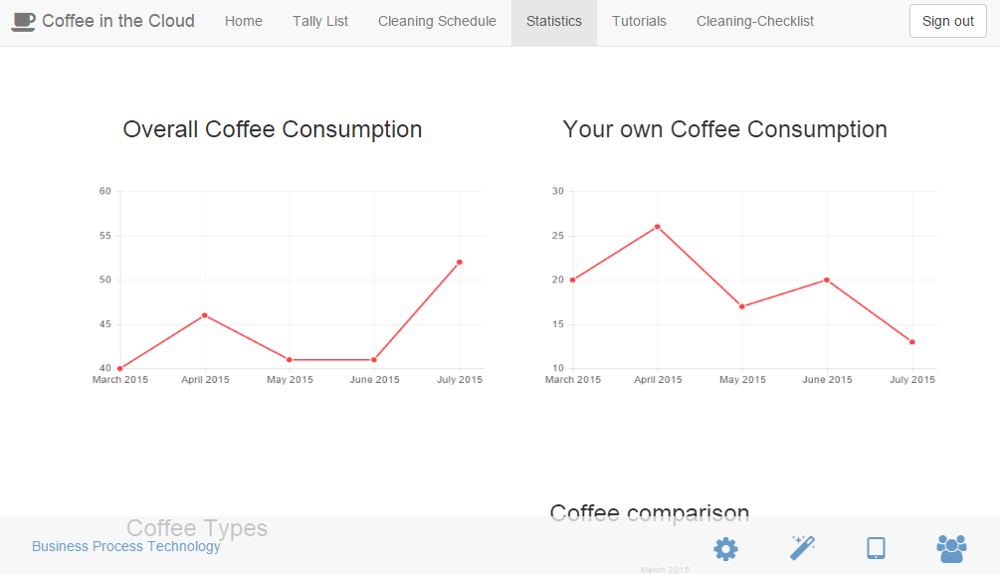

# User manual

## Tablet

When accessing the application through the tablet in the kitchen you will see a list of users.

There you track a coffee without authenticating yourself by tapping on your profile picture. The list is sorted by the
amount of coffee a person consumed so you might have to scroll down a little bit.

In the following dialog you can select either a single or a double coffee by tapping on the small (single) or large
(double) cup.

In case the kitchen was dirty you can use the *Was the kitchen dirty?* button to message the person that tracked the
most recent coffee.

Afterwards you should see a notification that your coffee has been tracked successfully.

## Tutorials

In case you are not familiar with the process of coffee making you can select the *Tutorials* menu. There you will find
a picture tutorial with each step involved in making coffee.

You can switch to the next step by tapping on the current picture. If there is a decision to be made, like single/double
coffee, you have to tap on the corresponding picture.

## Cleaning Checklist

If you are assigned for cleaning you can use the cleaning checklist to keep track of the necessary steps. By tapping
on a step you can mark them as done. On the bottom you will find a button for resetting the checklist and marking the
cleaning as done.

## Login

When accessing the application through your browser you will see a welcoming screen like this.

In the top right corner you can sign in using your email and password. These credentials should be provided by a system
administrator.

After successfully logging in you will be greeted personally and can see an overview of your account like the amount
of coffees drunk or your current balance.

You can now access more modules than before.

## Tally List

The tally list screen gives you an overview of the last ten coffees that have been booked to your account. Apart from
that you will see your current balance.

In case you wrongfully booked a coffee you can remove it by accessing this page within half an hour.

## Cleaning Schedule

The cleaning schedule shows who is assigned for cleaning the kitchen in the next weeks. It differentiates between
weekly, biweekly and other cleaning. If a cleaning has successfully been done it will be crossed out.

If you are assigned for cleaning you will also get a notification and can mark it as done.

## Statistics

In case you wonder about how your own coffee consumption changed over time or how it compares to everyone else you can
do so using this page.

